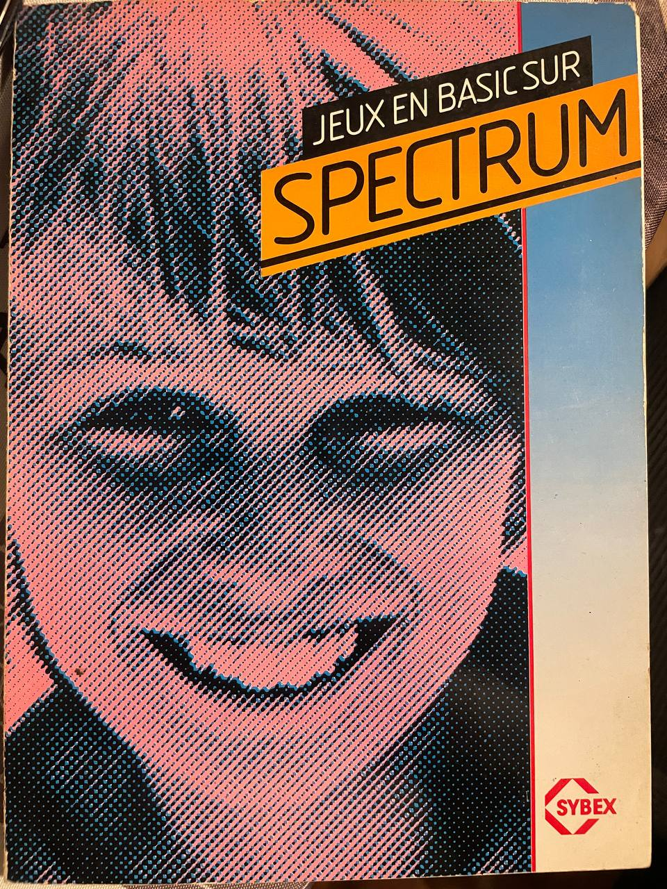
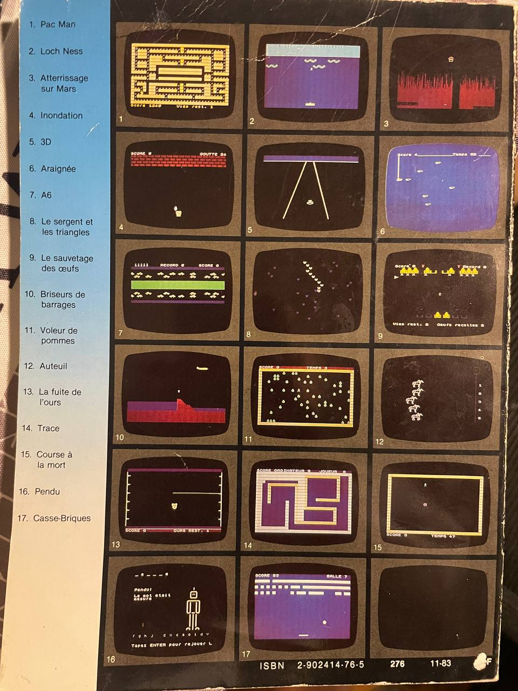

# Jeux en basic sur SPECTRUM


<div style="display: flex">


</div>

* Auteur : Peter Shaw
* Traduction : Jean-Pierre CANO
* Copyright : 1983, interface/Virgin Books, 1983, Sybex

## Avant-propos

Les jeux présentés dans ce livre utilisent toutes les possibilités de votre Spectrum : son, couleurs, caractères graphiques définissables par l'utilisateur (ces caractères sont indiqués en REM à la fin de chaque programme). Pour cette raison, ces programmes ne fonctionnent que sur l'ordinateur pour lequel ils ont été conçus et sont difficilement adaptables à des matériels différents.

Au-delà du jeu lui-même, l'étude de ces programmes vous enseignera de nombreuses techniques de programmation particulières à votre Spectrum qui vous seront très utiles pour développer vos propres programmes.

Tous ces jeux fonctionnent avec 16K de mémoire.

## Table de matières

* [Trucs et astuces de programmation](#trucs-et-astuces-de-programmation)
* [Le sauvetage des oeufs](#le-sauvetage-des-oeufs)
* Squash
* [Loch Ness](#loch-ness)
* [Araignée](#araignée)
* [Auteuil](#auteuil)
* [Pac Man](#pac-man)
* [Trace](#trace)
* [Casse-Briques](#casse-briques)
* Inondation
* Atterrrissage sur Mars
* Voleur de pommes
* La fuite de l'ours
* Le serpent et les triangles
* Course à la mort
* [Simon](#simon)
* 3D
* [A6](#a6)
* [Pendu](#pendu)
* [Briseurs de barrages](#briseurs-de-barrages)

## Trucs et astuces de programmation

Presque tous les programmes présentés commencent de la façon suivante :

```basic
10 REM Nom du programme
20 GO SUB 9000: REM Caractères graphiques
30 GO SUB 8000: REM Variables
40 GO SUB 7000: REM Dessin de l'écran
```

Outre qu'elle facilite le développement du programme par addition de lignes supplémentaires, cette disposition en accélère l'exécution, ce qui est primordial pour les jeux d'action en temps réel.

### Trucs et astuces

Le Spectrum permet une certain nombre de trucs et astuces de programmation qui ne sont pas présentés de façon évidente dans le manuel d'instruction et qui parfois n'y sont pas même mentionnés. Le symbole dièse (#) peut être utilisé dans les instructions PRINT pour afficher quelque chose en un point quelconque de l'écran :

```basic
PRINT #1,"Affichage en bas de l'écran ": PAUSE 0
```

Vous remarquerez que #1 affiche dans la partie basse de l'écran, permettant l'utilisation de 24 lignes.

Les ordinateurs Sinclair ZX sont probablement les seuls à ne pouvoir exécuter une instruction INPUT qu'en bas de l'écran ; cependant, en utilisant les instructions PRINT AT, il est possible d'obtenir une entrée en un point quelconque de l'écran :

```basic
INPUT AT 22,0; AT 0,0;"Quel est votre nom ";LINE a$; 
AT 10,0;"Quel est votre age ";(a$);" ";a; 
AT 15,0; "L'age de ";(a$);" est ";a; 
AT 20,0;"Tapez ENTER pour continuer";b$
```

Cette méthode présente plusieurs inconvénients. Comme vouz pouvez le constater, la longueur des lignes pose un problème. D'autre part, la couleur du pourtour de l'écran (BORDER) doit être la même que celle du centre (PAPER) car la partie inférieur de l'écran est étendue à la presque totalitéde celui-ci. Presque seulement car une bande reste visible à l'extrémité supérieur, à moins que BORDER et PAPER n'aient la même valeur.

## Loch Ness

Ce jeu est une variation du tir aux canards dans lequel les cibles traversent l'écran au-dessus de vous. Votre score augmente à chaque fois que vous atteignez une cible. Si vous réussissez à abattre une ligne complète de cibles, vous bénéficierez d'un bonus de 100 ou 200 points. Utilisez la touche <5> pour aller à gauche, la touche <8> pour aller à droite et la touche <0> pour tirer.

* [TAP file ](02-LOCHNESS.TAP)
* [BASIC file](02-LOCHNESS.BAS)

## Le sauvetage des oeufs

Dans ce jeu, vous devez réussir à sauver de pauvres oeufs sans défense en les arrachant aux forces maléfiques qui tentent de vous en empêcher en vous barrant la route avec des rayons lasers. Vous ramassez les oeufs en haut de l'écran. Quand vous transportez un oeuf, votre personnage devient vert. Vous devez éviter les rayons lasers et placer les oeufs en sécurité en passant sur les "-". Lorsque vous avez ramassé une demi-douzaine d'oeufs, vous obtenez cent points et une nouvelle série d'oeufs apparaît.

Ce jeu comporte plusieurs règles :
1. Si vous heurtez autre chose qu'un "X" ou un "-", vous perdez une vie.
2. Si vous êtes frappé par un rayon laser, ou si vous perdez une vie de toute autre façon, vous perdez automatiquement l'oeuf que vous transportiez. Si vous n'en transportiez pas, vous ne perdez qu'une vie.
3. Vous ne pouvez porter qu'un oeuf à la fois. Si vous essayez de ramasser un oeuf alors que vous en portiez déjà un en passant sur un "X", celui-ci disparaîtra, rendant impossible le ramassage ultérieur de l'oeuf.
4. Au début du jeu, vous avez trois vies. Utilisez les touches de contrôle du curseur pour vous déplacer.

* [TAP file](09-OEUFS.TAP)
* [BASIC file](09-OEUFS.BAS)

## Araignée

Vous êtes une araignée affamée suspendue à un fil sur la gauche de l'écran, et les six grosses mouches qui entrent dans votre champ de vision sont vos principales proies. Vous avez quatre-vignt-dix-neuf secondes pour manger autant de mouches que possible. Utilisez la touche <6> pour les déplacement vers le haut, et la touche <7> pour les déplacements vers le bas.

* [TAP file](06-SPIDER.TAP)
* [BASIC file](06-SPIDER.BAS)

## Auteuil

Grâce à ce jeu, vous pouvez posséder un cheval de course sans avoir à le nourrir ni à nettoyer l'écurie. Vous possédez également 50 Francs qui vous permettront de faire fortune en juant aux courses. Cinq joueurs peuvent participer à ce jeu. Le gagnag est celui uqi finit avec la plus grosse somme d'argent. Les cotes sont affichées avant chaque course, et vous pariez sur le cheval de votre choix. Si vous n'avez plus d'argent mais que votre cheval gagne une course, vous recevrez une somme supplémentaire qui vous permettra de jouer dans la course suivante.

* [TAP file](12-AUTEUIL.TAP)
* [BASIC file](12-AUTEUIL.BAS)

## Pac Man

Voici certainement le plus célèbre des jeux vidéo. Cette version présente deux particularités :
1. Il n'y a qu'un fantôme.
2. Lorsque vous mangez les pilules d'énergie qui se trouvent dans les coins, vous obtenez un bonus. Mais vous ne pouvez pas manger le fantôme.

Utilisez les touches de déplacement du curseur pour vous déplacer.

Note : Les lignes 7010 et 7020 sont obtenus à l'aide des symboles "." (point) en vidéo inverse et "_" (souligné) en vidéo normale (shift 0).

* [TAP file](01-PACMAN.TAP)
* [BASIC file](01-PACMAN.BAS)

## Trace 

Dans ce jeu, vous jouez contre l'ordinateur. Vous vous déplacez à l'intérieur de l'écran en laissant derrière vous une trace. Si vous touchez la trace de l'ordinateur ou le côté de l'écran, ou si vous coupez votre propre trace l'ordinateur marque un point. L'ordinateur est très fort mais pas imbattable. Utilisez les touches de déplacement du curseur pour contrôler vos mouvements.

* [TAP file](14-TRACE.TAP)
* [BASIC file](14-TRACE.BAS)

## Casse-Briques

Ce jeu est une version du célèbre casse-brique. Le but du jeu est de gagner des points en cassant les briques d'un mur à l'aide d'une balle que vous renvoyez en la frappant avec votre raquette. Vous disposez de dix balles. Le jeu se termine lorsque dix balles ont été utilisées. La touche <5> permet de déplacer la raquette vers la gauche et la touche <8> vers la droite. Vous pouvez également choisir la vitesse de la balle : de 1 (rapide) à dix (lent).

* [TAP file](17-ARKANOID.TAP)
* [BASIC file](17-ARKANOID.BAS)

## Atterrissage sur Mars

Réussirez-vous à poser votre vaisseau spatial sur l'aire d'atterrissage ? Le passage est étroit et il faut d'excellents réflexes et des nerfs d'acier pour se poser sans casse. Après le premier atterrissage réussi, vous piloterez un vaisseau plus rapide. Soyez prudent ou vous risquez de rester définitivement sur Mars. Utilisez la touche <5> pour vous déplacer vers la gauche et la touche <8> pour vous déplacer vers la droite.

* [TAP file](03-MARS.TAP)
* [BASIC file](03-MARS.BAS)

## Simon

l'ordinateur choisit une série de couleurs correspondant à des sons et vous devez retrouver la série exacte. Il y a quatre couleurs distinctes. La série débute avec une couleur choisie au hasard ; à chaque fois qu'elle est répétée, une autre couleur est ajoutée. La longueur de la série varie de un à dix.

* [TAP file](18-SIMON.TAP)
* [BASIC file](18-SIMON.BAS)

## A6

Traverser l'autoroute A6 à l'heure de pointe n'est une partie de plaisir pour personne, mais c'est pourtant le but de ce jeu. Vous devez éviter deux files de voitures roulant en sens inverse ; si vous êtes écrasé par l'une d'elles vous perdez l'une de vos cinq vies. Pour chaque piéton arrivé sain et sauf, vous gagnez dix points. Il y a un record à battre. Utilisez les touches de déplacement du curseur pour contrôler vos mouvements.

* [TAP file](07-A6.TAP)
* [BASIC file](07-A6.BAS)

## Pendu

L'ordinateur affiche sur l'écran un nombre de tirets correspondant au nombre de lettres du mot à trouver. Vous choisissez ensuite une lettre. Si elle est contenue dans le mot recherché, elle s'inscrit à sa place et vous pouvez rejouer. Si cette lettre est mauvaise, l'ordinateur commence à imprimer à l'écran un homme sur le point d'être pendu. Vous avez droit à treize erreurs avant l'issue fatale. Lorsque vous avez choisi une lettre et que vous la tapez, l'ordinateur affiche toutes les occurrence de cette lettre. Dans le mot "carrosse", par exemple, il y a deux r ou les deux s. Comme vous pouvez le remarque en lisant le listing ce programme dispose d'un dictionnaire étendu, ainsi la personne qui tape le programme peut jouer avec sans reconnaître à coup sûr le mot choisi.

* [TAP file](16-HANGUP.TAP)
* [BASIC file](16-HANGUP.BAS)

# Briseurs de barrages

Durant votre vol de retour, après une mission sur l'Allemagne, vous avez des problèmes de moteur et vous perdez de l'altitude. Le seul endroit sûr pour vous poser est une rivière. Malheureusement il y a un barrage sur votre chemin et vous devez le faire sauter. Utilisez la touche <0> pour larguer vos bombes.

* [TAP file](10-BARRAGES.TAP)
* [BASIC file](10-BARRAGES.BAS)